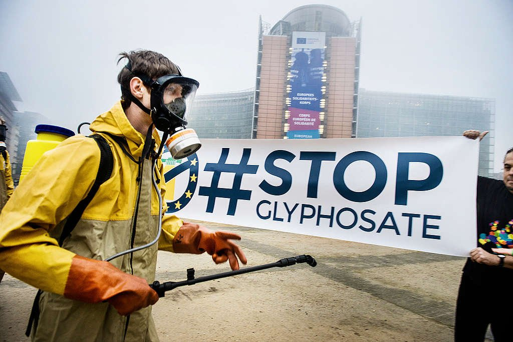
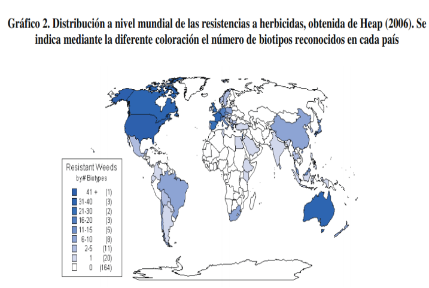
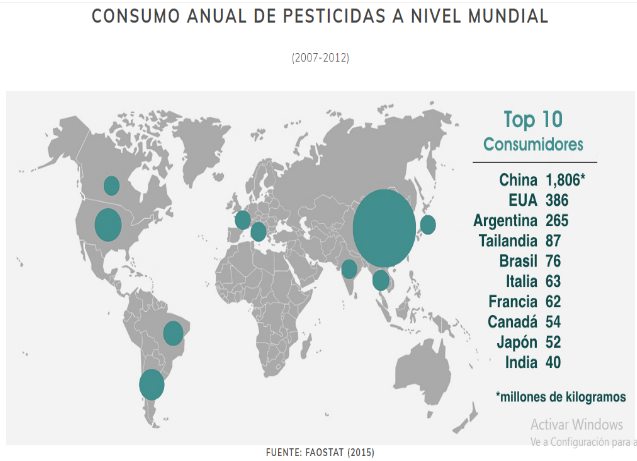
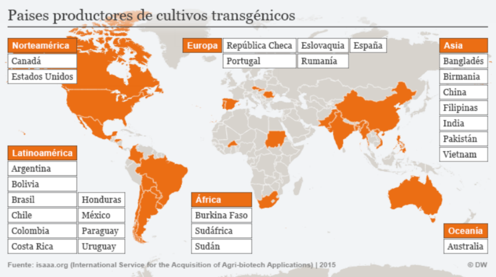

<html>
	<head>
			<meta charset="utf-8">
			<center>MENTIRAS DE MUERTE Y GLIFOSATO</center>
</head>
	<body>
<blockquote>
				<center><h2>MENTIRAS DE MUERTE Y GLIFOSATO</h2></center>
				<p>Hoy en día debido al crecimiento exponencial de la población se ha incrementado la demanda de más alimentos en  periodos de tiempo muy estrechos, sin importar el lugar, es una necesidad básica que debemos cubrir. Debido a esa  demanda, las empresas productoras de alimentos buscan incrementar su producción de manera eficiente, para lo cual  hacen uso de alto contenido de agroquímicos dentro de ellos, fungicidas, pesticidas y herbicidas, muchas veces de  forma innecesaria, solo para garantizar una alta producción y pocas perdidas. Es por ello que abordar el tema del  glifosato ya no solo es de índole científico, pues ahora a nosotros como comunidad nos corresponde estar informados  sobre lo que sucede detrás de la industria alimentaria. En este artículo explicaremos de manera detallada y concisa <strong>que es el glifosato, modo de acción, enfermedades que  causa y sobre todo las medidas alternas para disminuir o erradicar su uso</strong>, ser amigables con el ambiente, para no causar  daño en la biota y proteger la salud humana por los efectos adversos que causa este herbicida en la acumulación no  solo en la tierra, sino también en las aguas, el aire y los alimentos de consumo rutinario.</p>
	            <center>
	            <p><h6><em>En 2017, se llevó a cabo una acción conjunta en Europa (Bruselas, Madrid, Roma, Berlín y París), organizada por Greenpeace y miembros de otras ONGs para impulsar una Iniciativa Ciudadana Europea que regule los pesticidas y prohíba el glifosato. © Greenpeace / Eric De Mildt. © Eric De Mildt / Greenpeace</em></h6></p></center>


			<h4>¿QUÉ ES EL GLIFOSATO?</h4>
			<p>El glifosato es un herbicida de amplio espectro, no selectivo y sistémico: cualquier planta puede absorberlo a través de  sus tejidos, según el tipo de aplicación que se realice. 
			El glifosato mata las plantas interfiriendo con la síntesis de los  aminoácidos y detiene el crecimiento a las pocas horas de la aplicación. 
			El glifosato es el principio activo del herbicida Roundup (nombre comercial  
			producido por Monsanto comprada por la compañía Bayer en 2018). Adicionalmente esta compañía ha producido muchos alimentos transgénicos resistentes al glifosato como: variedades de canola, maíz, algodón, soya, remolacha  
			azucarera, trigo y algodón. 
			Actualmente, el glifosato es el herbicida más usado a nivel mundial y principalmente en Estados Unidos.  
			A pesar de que durante años se pensó que su uso no representaba ningún impacto negativo para el entorno ni para la  salud humana, poco a poco se acumuló evidencia del potencial daño que encierra este químico. También resulta  importante hacer un análisis desde el punto de vista de resistencia microbiana, de cómo estos microorganismos  posteriormente pueden infectar los seres humanos creando así un desbalance ambiental, microbiano y la relación con  los seres vivos entre ellos la raza humana. No se necesita ser alguien de muchos conocimientos para darse cuenta que  ha traído más desventajas que ventajas la producción masiva de alimentos. 
			Entre los agricultores e industrias la práctica sigue siendo con desinterés e incluso ignorancia, porque para quienes  hacen negocios vendiendo y aplicando productos químicos es algo “bueno” eliminar las malezas, lo que no están  tomando en cuenta es, que no solo ataca las “malas hierbas” sino que también daña a la vegetación nativa, provocando  la destrucción de cualquier otro tipo de planta que intente germinar en ese suelo, inclusive los propios cultivos, lo que  a su vez, resulta en daños ambientales desequilibrando la flora, fauna y perjudicando la salud de las personas.</p>


			<h4>ESTADÍSTICAS DE ZONAS DONDE SE CULTIVA Y USA GLIFOSATO</h4>
			<p>Para ver el efecto de los plaguicidas y transgénicos en la salud humana, resulta importante hacer un análisis desde el  punto de vista de <strong>resistencias microbianas, producción de transgénicos, plaguicidas, y sus usos, en comparación con  estadísticas de enfermedades causadas por agroquímicos</strong>. El uso reiterado de herbicidas, tiene como consecuencia  secundaria, <strong>la producción de resistencias en las malezas</strong>, lo que conlleva a perder el control adecuado del cultivo e  implica la sustitución del herbicida por otro agroquímico, que posiblemente genere resistencia microbiana. En el mundo  diferentes zonas agrícolas han presentado este tipo de resistencia, la cual se refleja como consecuencia de la utilización  de agroquímicos en el mundo.</p>
			<center>&nbsp;&nbsp;&nbsp;&nbsp;&nbsp;&nbsp;&nbsp;&nbsp;&nbsp;&nbsp;&nbsp;&nbsp;&nbsp;&nbsp;&nbsp;&nbsp;&nbsp;&nbsp;&nbsp;&nbsp;</center>
			<p><h6><em>Distribución mundial de la resistencia a herbicidas, obtenida  de heap (2006).Fuente:Manejo de poblaciones de malezas resistentes a  herbicidas 100 preguntas sobre resistencias.&nbsp;&nbsp;&nbsp;&nbsp;&nbsp;&nbsp;&nbsp;&nbsp;&nbsp;&nbsp;&nbsp;&nbsp;&nbsp;&nbsp;&nbsp;&nbsp;&nbsp;&nbsp;&nbsp;&nbsp;Consumo anual de pesticidas a nivel mundial. Fuente: plaguicidas sintéticos: realidad y ficción, marzo 16, 2017</em></h6></p>

			<p>Como se observa en la gráfica 2, Se encuentra américa del norte, américa del sur, Australia, Europa, China y amplias  zonas de África, como los principales consumidores de agroquímicos, donde estas mismas zonas coinciden con la  distribución a nivel mundial de las resistencias a herbicidas, ver gráfica 1, Al igual que el análisis anterior, se puede ver,  que las zonas donde hay presencia de resistencia a herbicidas, coinciden con las zonas donde hay producción de cultivos  transgénicos, tal como se observa en la gráfica 3.</p>
			<center>
			<p><h6><em>Países productores de cultivos transgenicos. Fuente: Alimentos transgénicos al desnudo (https://www.dw.com/es/actualidad/s-30684)</em></h6></p></center> 
			<p>Claramente las consecuencias en las afectaciones de la salud humana, se ven reflejadas en mayor medida en las zonas  mencionadas, sin embargo, es importante tener en cuenta que el uso del glifosato es más frecuente en la agricultura y  como también en el uso doméstico, como por ejemplo en huertas de pequeños productores e incluso en huertas  caseras. Como dato importante, en Colombia y en México se ha usado el glifosato de manera descontrolada mediante  la aspersión aérea de glifosato, para la erradicación de cultivos ilícitos de coca, marihuana y amapola, causando daños  a cultivos lícitos, aguas residuales y afectación a la salud pública.</p>


			<h4>TOXICIDAD</h4>


			<p>A continuación, hablaremos a grandes rasgos de la toxicidad en agua, suelo, alimentos y humanos, mientras explicamos cómo se produce esta cadena.</p>
			<strong><h5>TOXICIDAD EN EL AGUA</h5></strong>
			<p>En ecosistemas de agua dulce, muchos plaguicidas llegan de forma directa o indirecta (riego de suelos o aéreo), en donde se acumulan y afectan la calidad del agua, como también de organismos no considerados, modificando la estructura y funcionalidad de ecosistemas acuáticos. Algunas de las afecciones causadas por esto, son el retardo en el crecimiento de organismos como algas y peces, inhibición de la eclosión  de erizos, cambios histopatológicos en branquias de tilapia, como proliferación de células filamentosas e hiperplasia celular, entre otros.</p>
			<strong><h5>TOXICIDAD EN EL SUELO</h5></strong>
			<p>En los suelos los herbicidas (como el glifosato), empiezan un proceso de degradación biológica, el cual tiene la capacidad de desplazarse del tejido vegetal hacia el suelo, de manera que las persistencias de los herbicidas pueden aumentar de dos a seis veces en suelos en los que pudiesen existir restos y actuar sobre plantas a los que no se aplicó previamente. Este acumulo genera a su vez, resistencia microbiana o producción de resistencias en las malezas. En el mundo diferentes zonas agrícolas han presentado este tipo de resistencia, la cual se refleja como consecuencia del consumo de agroquímicos en el mundo.</p>
			<strong><h5>TOXICIDAD EN ALIMENTOS Y ENFERMEDADES EN HUMANOS</h5></strong>
			<p>Las plantas transgénicas resistentes al glifosato, estas también contienen residuos de herbicidas que presentan una serie de posibles riesgos para la seguridad en animales y seres humanos. A continuación, se presenta un listado de casos de las enfermedades, que encontramos están frecuentemente relacionadas con glifosato. Los posibles daños incluyen: la toxicidad directa del glifosato en sí, que se ha demostrado que puede causar alteraciones endocrinas, daño en el ADN, toxicidad reproductiva y del desarrollo, neurotoxicidad, encefalopatía, parkinsonismo; diferentes tipos de cáncer; linfoma no hodgkin (LNH) y teratogénesis (malformaciones) por defectos de nacimiento; las alergias están aumentando, los animales están mostrando respuestas alérgicas, incluyendo estómagos irritados e inflamados, decoloración de la mucosa gástrica y perforaciones intestinales; lo que se traduce en síntomas conductuales de irritabilidad y comportamiento antisocial en las vacas (anormal en animales de manadas) y otros animales.</p>


			<h4>ESTADÍSTICAS ÍNDICE DE MORTALIDAD/ENFERMEDADES</h4>

			<p>Diferentes estudios experimentales (in vitro) y estudios de correlación (epidemiológicos), han demostrado que diferentes productos a base de glifosato, han afectado la salud humana. Según la bibliografía, se han reportado efectos genotóxicos, hormonales y efectos enzimáticos en los mamíferos. En varios estudios, el glifosato se asoció con un aumento de aductos de ADN en ratones y un efecto mutagénico débil en el ensayo de Salmonella. Por lo que parte de las estadísticas de enfermedades crónicas a nivel mundial, son causadas por este tipo de herbicidas, donde los grupos de población más expuestos a estos agroquímicos, son los agricultores y quienes aplican estos plaguicidas, pues se exponen a altos niveles de esta sustancia química diariamente; y los bebes y/o fetos, que en la mayoría de casos son expuestos por medio de sus madres a este tipo de sustancias</p>


			<h4>SOLUCIONES ALTERNAS</h4>

			<p>Claramente las consecuencias en las afectaciones de la salud humana, se verán más presentes en las zonas mencionadas anteriormente, sin embargo, es importante tener en cuenta que el uso del glifosato es usado tanto en la agricultura industrial y también para uso doméstico. En agricultura para pre cosecha, post siembra y pre emergencia, en huertos, silvicultura, control intensivo de malezas, viñas, y pastos, como en uso de cultivos transgénicos de maíz, algodón, y soya resistente; y de forma doméstica en pequeñas huertas y jardines residenciales. Ahora no es necesario, sino también obligatorio, el pensar en otras alternativas, no solo para el bienestar de los ecosistemas sino de la salud humana, que ha acarreado una serie de enfermedades nuevas y de antaño pero ahora más resistentes a tratamientos. A continuación enunciamos las medidas alternas más usadas actualmente por agricultores y que han funcionado de manera efectiva en la mayoría de los casos.</p>

			<strong><h5>MÉTODOS MECÁNICOS, MANUALES Y TÉRMICOS</h5></strong>
			<p>Son los métodos más respetuosos con el ambiente y salud de las personas, pueden generar empleos, se usan para remover plantas indeseadas. La extracción manual de malas hierbas es adecuada para pequeños espacios o lugares donde el crecimiento de hierbas es escaso. Las escardas y siegas mecánicas eliminan o recortan hierbas ya germinadas o en desarrollo usando maquinaria en relación al tamaño del área. La escarda térmica aplica calor con quemadores de gas o infrarrojo sobre las hierbas a eliminar para deshidratarlas.</p>

			<strong><h5>FALSAS SIEMBRAS</h5></strong>
			<p>Permite eliminar las hierbas y malezas, ideal para antes de establecer una cubierta o acolchado, para lo que se prepara el terreno y se riega provocando que germinen y facilitando su extracción, puede repetirse cuantas veces haga falta.</p>

			<strong><h5>CUBIERTAS, MULCHING, ACOLCHADOS Y GRAVAS</h5></strong>
			<p>Se usan para impedir la germinación y crecimiento de las plantas, proteger de la erosión, filtrado de agua y compactado, además de ahorrar agua y mano de obra, y si es orgánica, aportarán progresivamente nutrientes de lenta incorporación, si es otro cultivo, además se reutiliza la poda como acolchado, conservan la mesofauna y limitan la germinación de malas hierbas</p>

			<strong><h5>ALELOPATÍA</h5></strong>
			<p>Mediante la secreción de aleloquímicos por parte de algunas plantas se puede inhibir el crecimiento de otras plantas, además sirven de abono.</p>

			<strong><h5>ROTACIÓN DE CULTIVOS</h5></strong>
			<p>Consiste en cultivar distintos cultivos compatibles entre sí para enriquecer el suelo y mantener la fertilidad del mismo al cambiar plantas exigentes por otras enriquecedoras</p>

			<strong><h5>CONTROL BIOLÓGICO</h5></strong>
			<p>La producción y uso de entomófagos, entomopatógenos y conservación de enemigos naturales al diversificar los sistemas permiten la biorregulación de las plagas.</p>

			<strong><h5>METABOLITOS SECUNDARIOS Y BIOMOLÉCULAS PESTICIDAS</h5></strong>
			<p>Este tópico en específico está siendo trabajado por otros miembros de nuestro club de ciencia. Existen muchas plantas con actividad pesticida, pero hay muchas sin estudio de sus compuestos purificados independientemente. Las más populares son: Tabaco nicotiana, Theprosia, Chrysanthemum (nicotina, rotenona, piretrinas), Ocimum basilicum, Tagetes erecta, Azadirachta indica, Origanum vulgare y Euphorbia láctea. Especies de Burkholderia y piperaceae sin patogenicidad conocida en vertebrados muestran actividad pesticida. Pueden ser compuestos bioactivos como taninos, fenoles y terpenos, monoterpenos, sesquiterpenos, cianohidrinas, ésteres y aceites esenciales. Las hojas de yuca la protegen de orugas, cenizas de hojas de Lantana spp. y Ochroma logopur se usan en polvo contra áfidos en papas, extracto de la semillas de neem (A Indica) como insecticida, extracto de cianohidrinas y esteres de lino, mandioca, hueso de durazno y almendra contra moscas y larvas de mosquito. En los insectos pueden inhibir reguladores de crecimiento, inhibidores de la alimentación, y repelentes por irritación</p>

			<strong><h5>MICROALGAS</h5></strong>
			<p>Se pueden cultivar usando aguas residuales, reciclando nutrientes y con potencial de usarse como fertilizante, y biocontrolador, algunas incluso actúan como bioestimulantes y biopesticidas, además, reducen las emisiones de gases de efecto invernadero. Los huertos caseros buscan reducir costos y favorecer el medio ambiente, para lo que deben usarse biopesticidas provenientes de plantas, que al degradarse puedan usarse como abono con frecuencia y constancia, también podemos apoyarnos de insectos y hongos que controlan plagas.
			El herbicida como sabemos está estrechamente asociado con la agricultura, usado como medio de cese de maleza, pero, la industria agrícola masiva y de monocultivos, no solo nos oculta el verdadero potencial peligroso de este herbicida, sino que además de ello viene con un acompañante, los OGM. De esta manera ya no solo nos enfrentamos a erradicar el uso de glifosato sino también a frenar la producción de alimentos genéticamente modificados.
			La pregunta a plantear es, ¿Los compradores están haciendo mal uso del producto o las empresas solo buscan monetizar a costa de la salud pública? Por lo cual debemos cambiar y educar la población para el reemplazo de agroquímicos dañinos y con efectos residuales, por soluciones alternativas más amígales con el ambiente y la salud humana.</p>

			<p><em><h4>“LA OBLIGACIÓN DE RESISTIR NOS DA EL DERECHO DE SABER” ‐RACHEL CARSON.</h4></em></p>


</blockquote>

	</body>
</html>
### Markdown

Markdown is a lightweight and easy-to-use syntax for styling your writing. It includes conventions for

```markdown
Syntax highlighted code block

# Header 1
## Header 2
### Header 3

- Bulleted
- List

1. Numbered
2. List

**Bold** and _Italic_ and `Code` text

[Link](url) and 
```

For more details see [GitHub Flavored Markdown](https://guides.github.com/features/mastering-markdown/).

### Jekyll Themes

Your Pages site will use the layout and styles from the Jekyll theme you have selected in your [repository settings](https://github.com/CdeCMx-org/proyectos-2021-club_17_1/settings/pages). The name of this theme is saved in the Jekyll `_config.yml` configuration file.

### Support or Contact

Having trouble with Pages? Check out our [documentation](https://docs.github.com/categories/github-pages-basics/) or [contact support](https://support.github.com/contact) and we’ll help you sort it out.
